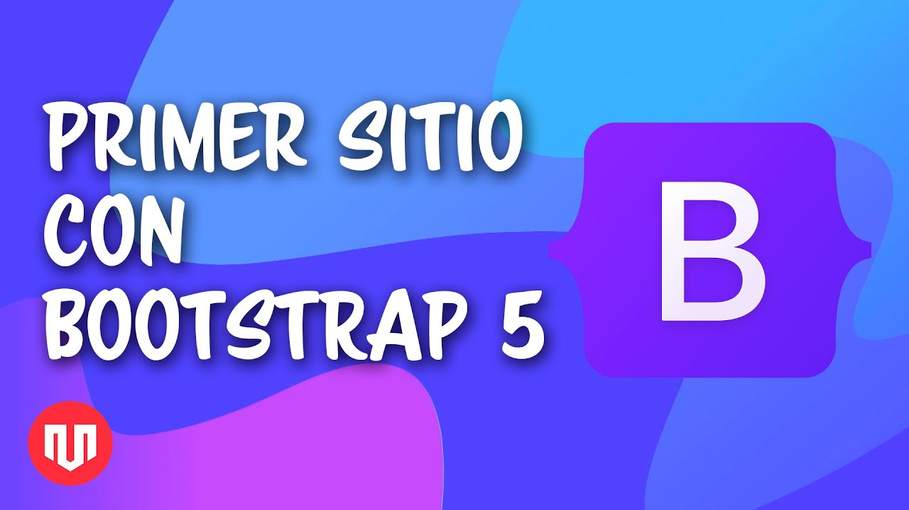

# Sitio web creado con Bootstrap 5

Este es el repositorio para poder seguir el tutorial para [crear un sitio web con Bootstrap 5](https://www.youtube.com/watch?v=ZuOL_DoaG9k).

## Archivos del repositorio

Hay dos carpetas en el repositorio
- Archivos iniciales: los archivos para poder hacer el tutorial desde cero.
- Ejercicio final: los archivos finales con el sitio web terminado.

## Instrucciones para ejecutar el sitio web

Clona el proyecto en tu computadora

`git clone https://github.com/marcosrivasr/bootstrap5-website.git`

Para poder ejecutar el sitio web completo ve a `ejercicio final` y abre el archivo `ìndex.html`.

Para trabajar con los archivos iniciales te recomiendo la extensión de [Live Server](https://marketplace.visualstudio.com/items?itemName=ritwickdey.LiveServer#:~:text=%20Shortcuts%20to%20Start%2FStop%20Server%20%201%20Open,to%20Stop%20the%20server%20%28You%20can...%20More%20)

## Tutorial en Youtube

Los invito a ver el tutorial sobre cómo [crear un sitio web con Bootstrap 5](https://www.youtube.com/watch?v=ZuOL_DoaG9k) en el canal de Youtube.